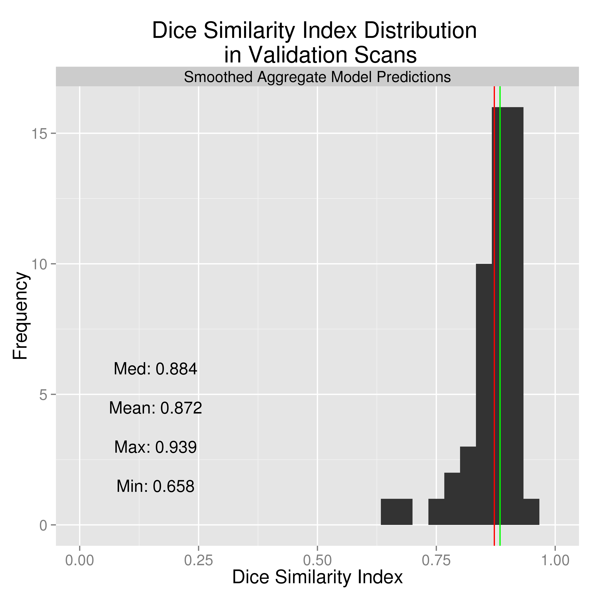

  
<script type="text/x-mathjax-config">
  MathJax.Hub.Config({ TeX: { extensions: ["color.js"] }});
</script>
  
```{r opts, prompt=FALSE, echo=FALSE, message=FALSE, warning=FALSE, error=FALSE, comment=""}
library(knitr)
opts_chunk$set(echo=FALSE, prompt=FALSE, message=FALSE, warning=FALSE, comment="", results='hide')
setwd("~/CT_Registration/Oral_Proposal/")
```


```{r, prompt=TRUE, echo=FALSE, message=FALSE, warning=FALSE}
rm.obj = ls()
rm.obj = rm.obj[ !(rm.obj %in% c("fname", "slide"))]
rm(list=rm.obj)
library(ggplot2)
library(xtable)
library(scales)
library(fslr)
options(stringsAsFactors=FALSE)
username <- Sys.info()["user"][[1]]
rootdir = file.path("/Users", username, "Dropbox/CTR/DHanley/MISTIE")
homedir = file.path(rootdir, "ICH Analysis")
Mdir = file.path(rootdir, "MISTIE DSMB Analysis")
resdir <- file.path(homedir, "results")
rundir <- file.path(resdir, "Manuscript")
progdir <- file.path(homedir, "stataprograms")
datadir <- file.path(Mdir, "statacalc")
knitdir <- "~/CT_Registration/Oral_Proposal/"
load(file=file.path(rundir, "All_IncludingICES_Patients.Rda"))
load(file=file.path(rundir, "Randomized_Patients.Rda"))
load(file=file.path(knitdir, "111_Filenames.Rda"))
```


## What is Intracranial hemorrhage?

<div class="columns-2" style='font-size: 28pt;'>
  - When a blood vessel ruptures into 
+ tissue: intracerebral hemorrhage (ICH)
+ ventricles: intraventricular hemorrhage (IVH)
- ≈ 13% of strokes    


<a href = "http://www.heartandstroke.com/site/c.ikIQLcMWJtE/b.3484153/k.7675/Stroke__Hemorrhagic_stroke.htm" style ="font-size:10.5px" >http://www.heartandstroke.com/site/c.ikIQLcMWJtE/b.3484153/k.7675/Stroke__Hemorrhagic_stroke.htm</a>
  
</div>
  
## Get ICH Mask from Manual Segmentation
  
<div class="columns-2">


</div>

## Covariates   

## PItcHPERFECT uses Logistic Regression
  Let $y_{i,j}$ be the presence / absence of ICH for voxel $j$ from person $i$.
$$
  \text{logit}\left(y_{i, j}\right) = \beta_0 + \sum_{k= 1}^{p} x_{i, j, k}\beta_{k}
$$
  
  * Case-control sample voxels for a fixed percentage (25%) of outcome

  
  ```{r, }
pngname = file.path(knitdir, "figure", "Breakdown.png")
png(pngname, height=3, width=6, units="in", res=600)
par(oma = rep(0, 4), mar=c(0, 0, 0, 0))
plot(c(290, 400), c(100, 200),  type= "n", xlab="", ylab="", xaxt = "n",
     yaxt = "n", bty="n")
rect(290, 100, 400,  200,  col = "red", border=NA) # transparent
rect(310, 100, 400,  200,  col = "blue", border=NA) # transparent
rect(350, 100, 400,  200,  col = "green", border=NA) # transparent
legend(x = 300, y = -1, legend= c("Training", "Validation", "Test"))
tcol = "black"
text.cex = 1.5
text(x = 300, y = 150, labels = "10", col=tcol, cex=text.cex)
text(x = 300, y = 140, labels = "Train", col=tcol, cex=text.cex)
text(x = 300, y = 130, labels = "+", col=tcol, cex=text.cex)
text(x = 300, y = 120, labels = "Cutoff", col=tcol, cex=text.cex)
text(x = 327.5, y = 150, labels = "51", col="white", cex=text.cex)
text(x = 327.5, y = 140, labels = "Validate", col="white", cex=text.cex)
text(x = 375, y = 150, labels = "51", col=tcol, cex=text.cex)
text(x = 375, y = 140, labels = "Test", col=tcol, cex=text.cex)
dev.off()
```

## 


## Prediction Comparison: DSI: 0.90
```{r, eval=FALSE}
#dice.mod.dice[which(fdf$id == '161-413'),'mod_agg']
```


# Thanks

