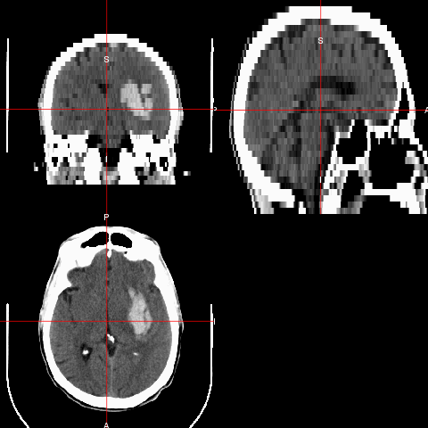
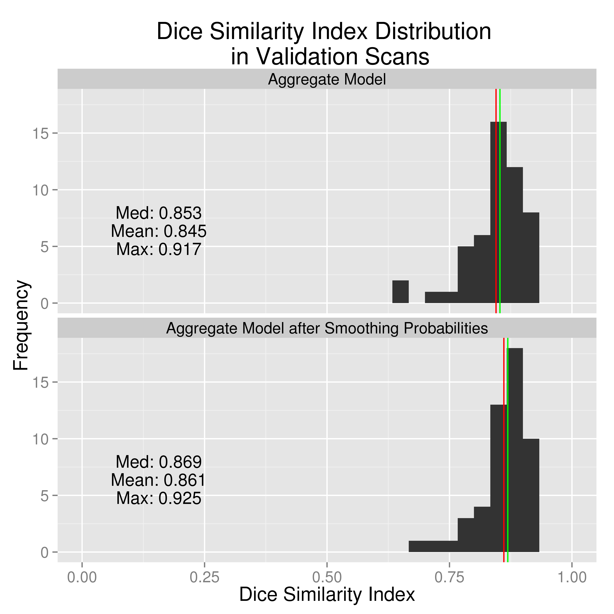

# Automatic Intracerebral Hemorrhage Segmentation of CT Scans
John Muschelli  
January 13, 2015  

## Logic of the Talk

* We have patients with Intracerebral Hemorrhage and CT Data 
* Problem: Manual Segmentation of Intracerebral Hemorrhage is costly
* We propose an automated solution using logistic regression

## What is Intracranial hemorrhage?

 - When a blood vessel ruptures into 
    + tissue: intracerebral hemorrhage (ICH)
    + ventricles: intraventricular hemorrhage (IVH)
 - ≈ 13% of strokes    

http://www.heartandstroke.com/site/c.ikIQLcMWJtE/b.3484153/k.7675/Stroke__Hemorrhagic_stroke.htm

## X-ray Computed Tomography (CT) Scans

Images are acquired from an X-ray scanner.  
x-ray goes around object and detector the other side of the object determines how many x-rays are recovered 
- fancy transform
- Image!

 
Image from http://www.cyberphysics.co.uk/topics/medical/CTScanner.htm

## Data Used

|                 &nbsp;                  |    Overall    |
|:---------------------------------------:|:-------------:|
|           **Age (Mean (SD))**           | 60.66 (11.25) |
|          **Gender = Male (%)**          |   77 (68.8)   |
|              **Race (%)**               |               |
|              **Caucasian**              |   60 (53.6)   |
|          **African American**           |   35 (31.2)   |
|              **Hispanic**               |   12 (10.7)   |
|                **Other**                |   5 ( 4.5)    |
|  **Diagnostic ICH Volume (Mean (SD))**  | 37.74 (20.24) |
|  **Diagnostic IVH Volume (Mean (SD))**  |  3.23 (6.28)  |

CT scans from MISTIE (Minimally Invasive Surgery plus rt-PA for ICH Evacuation) trial.

- 112 scans from 112 patients (1 per patient)
- First scan patient received used

## Image Representation: voxels (3D pixels)

## CT scan Characteristics

- This is an example of a CT scan of a brain with no pathology
- Note the bone
An attenuation coefficient characterizes how easily the X-ray beam penetrated that area of the brain.

* Data are in Hounsfield Units (HU), which are "standardized"
$$
HU(v) = 1000 \times \frac{\mu(v) - \mu_{\text{water}}}{ \mu_{\text{water}}- \mu_{\text{air}}}
$$
where $\mu$ is the linear attenuation coefficient and $v$ denotes voxel.

## CT scan Characteristics 

- Here are the HU ranges for stuff

HU Ranges:

* Bone – high intensity (1000 HU)
* Air – low intensity (-1000 HU)
* Water - 0 HU
* Blood 30-80 HU
* White/Gray Matter ≈ 0 - 100 HU

## Intracerebral Hemorrhage: Segmented

## Larger ICH Volume ⇒ Worse Outcome

J. P. Broderick, T. G. Brott, J. E. Duldner, et al. **"Volume of intracerebral hemorrhage. A powerful and easy-to-use predictor of 30-day mortality."** In: _Stroke_ 24.7 (1993), pp. 987-993.

S. Davis, J. Broderick, M. Hennerici, et al. **"Hematoma growth is a determinant of mortality and poor outcome after intracerebral hemorrhage"**. In: _Neurology_ 66.8 (2006), pp. 1175-1181.

L. C. Jordan, J. T. Kleinman and A. E. Hillis. **"Intracerebral hemorrhage volume predicts poor neurologic outcome in children"**. In:
_Stroke_ 40.5 (2009), pp. 1666-1671.

S. Tuhrim, D. R. Horowitz, M. Sacher, et al. **"Volume of ventricular blood is an important determinant of outcome in supratentorial intracerebral hemorrhage"**. In: _Critical care medicine_ 27.3 (1999),
pp. 617-621.

## Problems with Manual Segmenation

* ICH are manually traced (**gold standard**)
    + Time-consuming (can be over 20 mins per scan), costly
    + Within and across-rater variability
* Infeasible for large databases

# Solution: Primary Intracerebral Hemorrhage Prediction Employing Regression and Features Extracted from CT (PItcHPERFECT)
## PItcHPERFECT uses Logistic Regression

Let $Y$ be the binary 0/1 indicator if a voxel $j$is classified as ICH, $1\dots v_{i}$  for person $i$.  
$$
\text{logit}\left(Y_{i, j}\right) = \beta_0 + X_{i, j}\beta
$$
where $X_{i,j}$ is a $v_{i}\times p$ matrix of predictors and $\beta \in \mathbb{R}^p$.  

- Note, we do not take into account the spatial dependence of voxels.
- This model may be fit on a person level (where $i$ is fixed), or across people $i$ varies.

## What are the predictors?
After some preprocessing and voxel selection, the predictors $X$ are

* Intensity in HU (Raw image)
* Indicator if intensity **$\geq 40$** & $\leq 80$ HU (thresholded)
* Z-scores in all 3 planes with only brain image
* Distance from the center of the brain
* Local moments (mean, sd, skew, kurtosis) of intensity and thresholded intensity
* Smoothed image with large Gaussian smoothers ($\sigma \in \{10, 20\}$mm)

## Estimation of Model

- Maybe a figure here instead of text

* Built the Model based on 10 subjects (first 10, not randomly)
  + Data were stratified sampled based on $Y$ and a fixed percentage (25%) of positive outcomes were included, and cutoffs were optimized on the 10 scans 

* Split the remaining subjects into $51$ validation scans and $51$ test scans and predicted $Y_{i,j}$.

* We will present results on the $51$ validation scans.

## Assessing Performance 

For each scan we can calculate the following 2-by-2 table and a corresponding Venn diagram:

<table class = 'rmdtable'>
<tr class = "header"><td></td><td></td><td colspan="2">Manual</td></tr>
<tr class = "header"><td></td><td></td><td>0</td><td>1</td></tr>
<tr><td rowspan="2"> PitCH</td><td>0</td><td>TN</td><td style="color:blue">FN</td></tr>
<tr><td>1</td><td style="color:red">FP</td><td style="color:purple">TP</td></tr>
</table>

## Dice Similarity {.build}

From this table, we can calculate the Dice Similarity Index (DSI):
$$
\definecolor{red}{RGB}{255,0,0}
\definecolor{blue}{RGB}{0,0,255}
\definecolor{purple}{RGB}{128,0,128}
\definecolor{blac,}{RGB}{0,0,0}
\frac{ \color{purple} 2 \times \#  \text{TP} }{ \color{purple}  2 \times \#\text{TP} \color{black} + \color{red} \text{FN} \color{black} + \color{blue} \text{FP}} 
$$

A DSI of:

- 0 indicates no overlap
- 1 means perfect agreement  

## Test case: Manual Segmentation
 

## Example Output: Automatic Segmentation
 

## Prediction Comparison: DSI: 0.90

## 

# Thanks

## Prediction Comparison: DSI: 0.686

## Demographics of Patients

|                 &nbsp;                  |    Overall    |
|:---------------------------------------:|:-------------:|
|           **Age (Mean (SD))**           | 60.66 (11.25) |
|          **Gender = Male (%)**          |   77 (68.8)   |
|              **Race (%)**               |               |
|              **Caucasian**              |   60 (53.6)   |
|          **African American**           |   35 (31.2)   |
|              **Hispanic**               |   12 (10.7)   |
|                **Other**                |   5 ( 4.5)    |
|  **Diagnostic ICH Volume (Mean (SD))**  | 37.74 (20.24) |
|  **Diagnostic IVH Volume (Mean (SD))**  |  3.23 (6.28)  |

Data from the MISTIE (Minimally Invasive Surgery plus rt-PA for ICH Evacuation) trial.

- Patients with ICH at presentation
- 112 patients from 112 scans 

