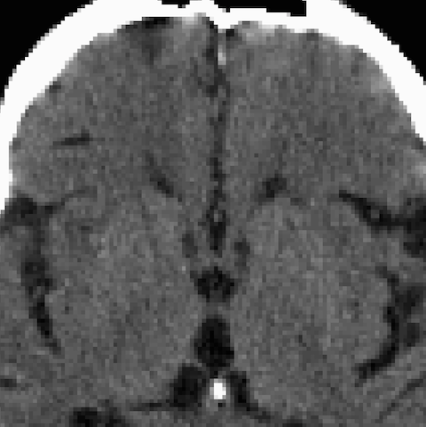
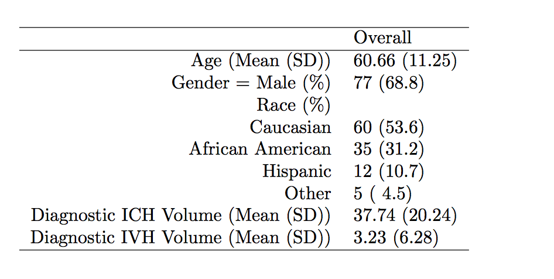
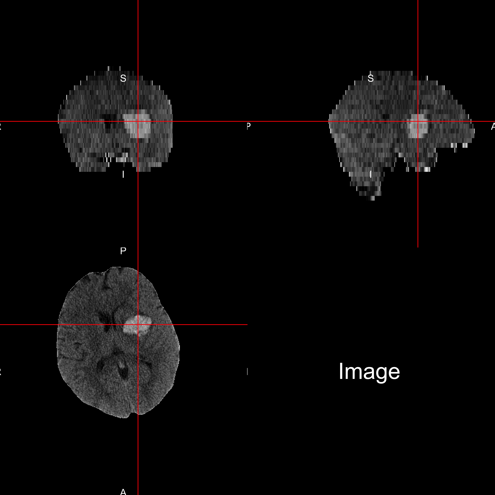
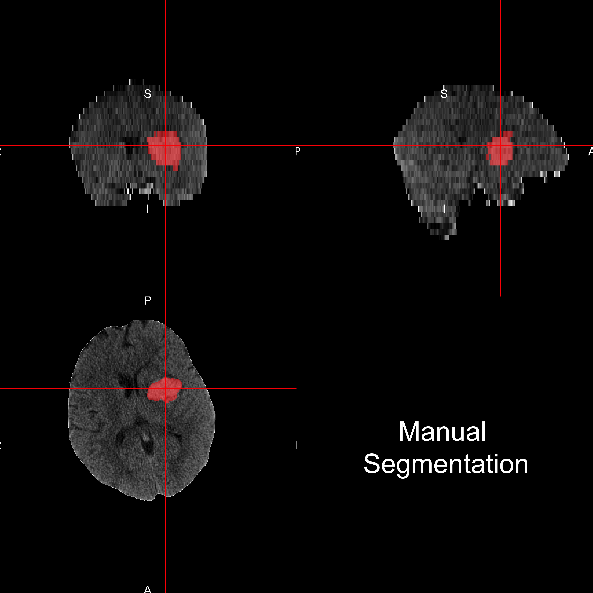

# Automatic Intracerebral Hemorrhage Segmentation of CT Scans
John Muschelli  
January 13, 2015  

## Outline of the Talk

* General Neuroimaging / CT Data
* Problem: Manual Segmentation of Intracerebral Hemorrhage
* Proposed Solution / Results
* Future Work

## CT Scanning

Images are acquired from an X-ray scanner.  Essentially a an x-ray goes around in a circle or revolves around an objects and passes in x-rays and a detector on the other side of the object to text how many x-rays are recovered.

 
Image from http://www.cyberphysics.co.uk/topics/medical/CTScanner.htm

## Image Representation: voxels (3D pixels)

## CT scan Characteristics {.flexbox .vcenter}

- This is an example of a CT scan of a brain with no pathology
- Note the bone
An attenuation coefficient characterizes how easily the X-ray beam penetrated that area of the brain.

http://www.osirix-viewer.com/datasets/

* Data are in Hounsfield Units (HU), which are "standardized"
$$
HU(v) = 1000 \times \frac{\mu(v) - \mu_{\text{water}}}{ \mu_{\text{water}}- \mu_{\text{air}}}
$$
where $\mu$ is the linear attenuation coefficient and $v$ denotes voxel.
 
 
 
 
 
 
 
 

## CT scan Characteristics {.flexbox .vcenter}

- Here are the intensity ranges for stuff

Ranges for Tissues:

* Bone – high intensity (1000 HU)
* Air – low intensity (-1000 HU)
* Water - 0 HU
* Blood 30-80 HU
* White/Gray Matter ≈ 0 - 100 HU

## What is Intracranial hemorrhage?

 - When a blood vessel ruptures into 
    + tissue: intracerebral hemorrhage (ICH)
    + ventricles: intraventricular hemorrhage (IVH)
 - ≈ 13% of strokes    

http://www.heartandstroke.com/site/c.ikIQLcMWJtE/b.3484153/k.7675/Stroke__Hemorrhagic_stroke.htm

## Demographics of Patients

Data from the MISTIE (Minimally Invasive Surgery plus rt-PA for ICH Evacuation) trial.

- Patients with ICH at presentation
- 112 patients from 112 scans 

## CT: Intracerebral Hemorrhage {.flexbox .vcenter}

## Intracerebral Hemorrhage: Segmented

## Problems with Manual Segmenation

* ICH are manually traced (**gold standard**)
  * Time-consuming
  * Within and across-rater variability
* Can't do for large databases
  * Important for some processes, such as image registration

## **Primary Intracerebral Hemorrhage Prediction Employing Regression and Features Extracted from CT (PItcHPERFECT)** 

$$
\text{logit}\left(Y_{i,j}\right) = \beta_0 + X_{i,j}\beta
$$
for $j$ voxels, $1\dots v_{i}$ for person $i$.  

* Creating predictor variables:
  * Raw intensity
  * Z-scores in all 3 planes with only brain image (skull stripped)
  * Indicator if intensity **$\geq 40$** (established threshold) & $\leq 80$ HU
  * Local moments (mean, sd, skew, kurtosis)
  * Large smoothers
* Run a **logistic regression** with these
* Model built on 10 subjects

## Example Output: 
 

## Example Output: Manual Segmentation
 

## Example Output: Automatic Segmentation
 

## Prediction Comparison
 

## Prediction Result: Population
 

## Conclusions and Extensions
 
* ICH Segmentation has high specificity
  * Good for Localization
  * OK for volume estimates
  * Good enough for adaptive randomization

## Thanks

Main Collaborators

<table>
<tr>
<td></td>
<td></td>
</tr>
</table>

<table>
<tr>

</tr> 
</table>

* Groups

<table>
<tr> <td></td> <td> </td>
</tr>
</table>

* Funding

<table>
<tr> <td>T32AG000247</td><td> NIA </td></tr>
<tr> <td>RO1EB012547</td><td> NIBIB</td> </tr>
<tr> <td>R01NS046309, RO1NS060910, RO1NS085211, R01NS046309, U01NS080824 and U01NS062851</td> <td>NINDS</td> </tr>
<tr><td>RO1MH095836</td> <td> NIMH </td></tr>
</table>

