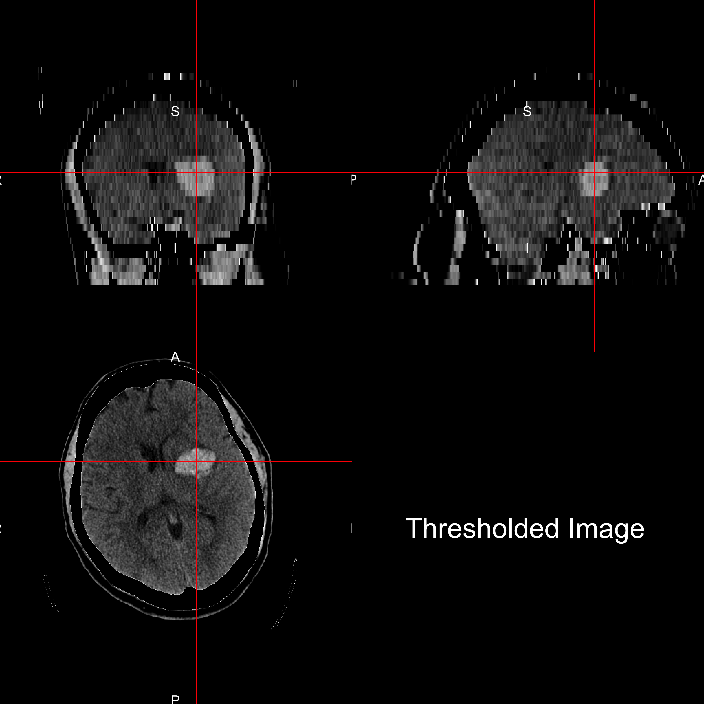
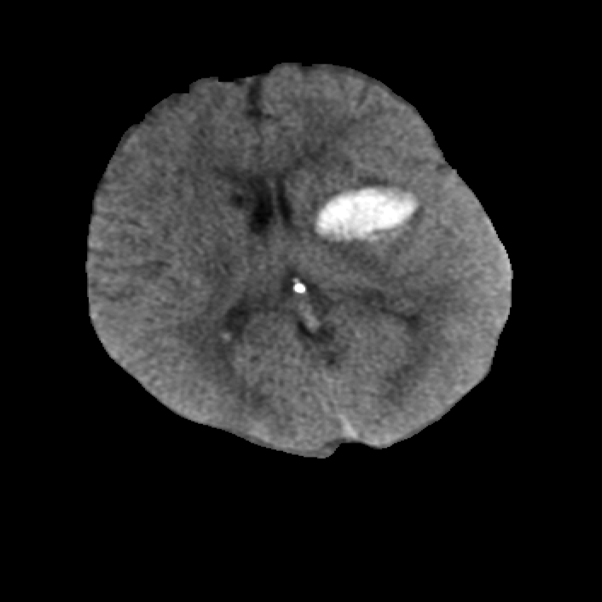
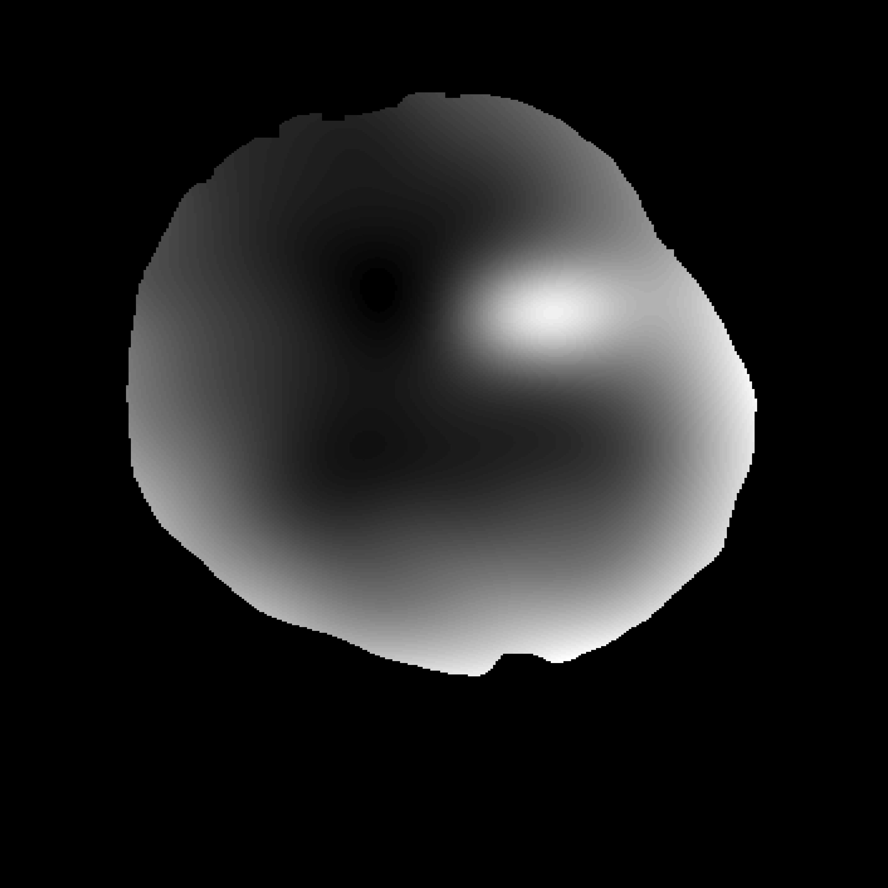

  
<script type="text/x-mathjax-config">
  MathJax.Hub.Config({ TeX: { extensions: ["color.js"] }});
</script>
  
```{r opts, prompt=FALSE, echo=FALSE, message=FALSE, warning=FALSE, error=FALSE, comment=""}
library(knitr)
library(knitcitations)
opts_chunk$set(echo=FALSE, prompt=FALSE, message=FALSE, warning=FALSE, comment="", results='hide')
setwd("~/CT_Registration/Oral_Proposal/")
```


```{r, prompt=TRUE, echo=FALSE, message=FALSE, warning=FALSE}
rm.obj = ls()
rm.obj = rm.obj[ !(rm.obj %in% c("fname", "slide"))]
rm(list=rm.obj)
library(ggplot2)
library(xtable)
library(scales)
library(fslr)
library(pander)
options(stringsAsFactors=FALSE)
username <- Sys.info()["user"][[1]]
rootdir = file.path("/Users", username, "Dropbox/CTR/DHanley/MISTIE")
homedir = file.path(rootdir, "ICH Analysis")
Mdir = file.path(rootdir, "MISTIE DSMB Analysis")
resdir <- file.path(homedir, "results")
rundir <- file.path(resdir, "Manuscript")
progdir <- file.path(homedir, "stataprograms")
datadir <- file.path(Mdir, "statacalc")
knitdir <- "~/CT_Registration/Oral_Proposal/"
load(file=file.path(rundir, "All_IncludingICES_Patients.Rda"))
load(file=file.path(rundir, "Randomized_Patients.Rda"))
load(file=file.path(knitdir, "111_Filenames.Rda"))
```{r demog}
library(tableone)
library(stargazer)
library(pander)
n.ids = length(unique(fdf$id))
demog = as.numeric(gsub("-", "", fdf$id))
demog = all.alldat[ all.alldat$patientName %in% demog, ]
stopifnot(nrow(demog) == n.ids)
demog$Diagnostic_ICH_Volume =demog$ICH_Dx_10 * 10 
demog$Diagnostic_IVH_Volume =demog$IVH_Dx_10 * 10 
vars = c("Age", "Gender",  
         "Diagnostic_ICH_Volume", "Diagnostic_IVH_Volume")
catvars = c("Gender")
tb1 = CreateTableOne(vars = vars, factorVars = catvars, 
                    data = demog)
tb1 = print(tb1, contDigits = 1)
rownames(tb1) = gsub("_", " ", rownames(tb1))
rownames(tb1) = gsub("mean", "Mean", rownames(tb1))
rownames(tb1) = gsub("(sd)", "(SD)", rownames(tb1), fixed=TRUE)
tb1 = tb1[rownames(tb1) != "n", , drop=FALSE]
# tb1 = pander.return(tb1)
# tb1 = tb1[ tb1 != ""]
```

## Neuroimaging Experience

<div class="columns-2">
- At Johns Hopkins (JHU) for 8 years
- ScM Degree in Biostatistics in 2010 (JHU)
- Consultant at JHU Consulting Center
  - Stroke clinical trial - 6 years
    - Reproducible Reports - 3 years
    - CT Imaging Analysis - 4 years
  - fMRI lab - 2 years


</div>

## Writing Reproducible Software and Analyses

All analyses/figures/slides were written in [`R`](https://cran.r-project.org/).

R Packages:

- fslr <p style='font-size: 12pt;'>(Muschelli, John, et al. "fslr: Connecting the FSL Software with R." R JOURNAL 7.1 (2015): 163-175.)</p>
- brainR <p style='font-size: 12pt;'>(Muschelli, John, Elizabeth Sweeney, and Ciprian Crainiceanu. "brainR: Interactive 3 and 4D Images of High Resolution Neuroimage Data." R JOURNAL 6.1 (2014): -48.)</p>
- WhiteStripe
- drammsr
- extrantsr
- dcm2niir
- matlabr
- spm12r

## PItcHPERFECT: Overall Goal 

<div class="columns-2">

Want to go from this


To This:

</div>


## What is Intracranial/Intracerebral hemorrhage?

<div class="columns-2" style='font-size: 28pt;'>
  - When a blood vessel ruptures into 
+ tissue: intracerebral hemorrhage (ICH)
+ ventricles: intraventricular hemorrhage (IVH)
- ≈ 13% of strokes


<a href = "http://www.heartandstroke.com/site/c.ikIQLcMWJtE/b.3484153/k.7675/Stroke__Hemorrhagic_stroke.htm" style ="font-size:10.5px" >http://www.heartandstroke.com/site/c.ikIQLcMWJtE/b.3484153/k.7675/Stroke__Hemorrhagic_stroke.htm</a>
  
</div>

## Stroke Trial Data

* Intracerebral (bleeds mainly in tissue, <strong>ICH</strong>) or Intraventricular (bleeds into ventricles, <strong>IVH</strong>) Hemorrhage trials

* Minimally Invasive Surgery plus rt-PA for ICH Evacuation (<strong>MISTIE</strong>) 
 - multi-center, multi-national Phase II clinical trial


* http://braininjuryoutcomes.com/mistie-about


## Larger ICH Volume ⇒ Worse Outcome

```{r biblio, results='hide'}
library(RefManageR)
library(knitcitations)
bib <- ReadBib(file.path(knitdir, 'Oral_Proposal.bib'))
x = sapply(bib, citep)
bibliography() 
```
<br>
<div style="font-size: 10pt; color:white;" id = 'botval-content'>
<br>
J. P. Broderick, T. G. Brott, J. E. Duldner, et al. **"Volume of intracerebral hemorrhage. A powerful and easy-to-use predictor of 30-day mortality."** In: _Stroke_ 24.7 (1993), pp. 987-993.

S. Davis, J. Broderick, M. Hennerici, et al. **"Hematoma growth is a determinant of mortality and poor outcome after intracerebral hemorrhage"**. In: _Neurology_ 66.8 (2006), pp. 1175-1181.

L. C. Jordan, J. T. Kleinman and A. E. Hillis. **"Intracerebral hemorrhage volume predicts poor neurologic outcome in children"**. In:
_Stroke_ 40.5 (2009), pp. 1666-1671.

S. Tuhrim, D. R. Horowitz, M. Sacher, et al. **"Volume of ventricular blood is an important determinant of outcome in supratentorial intracerebral hemorrhage"**. In: _Critical care medicine_ 27.3 (1999),
pp. 617-621.
</div>

## Measure ICH using Computed Tomography (CT)
<div class="notes">
Images are acquired from an X-ray scanner.  
x-ray goes around object and detector the other side of the object determines how many x-rays are recovered 
- fancy transform
- Image!
</div>
<div style="width:48%;float:left;">

<br>
<sub><sup><sub><sup>Image from http://www.cyberphysics.co.uk/topics/medical/CTScanner.htm</sup></sub></sup></sub>
</div>
<div style="margin-left:48%;">

</div>


## Image Representation: voxels (3D pixels)
<div class="columns-2">

<br>


</div>


## CT scan Characteristics
<div class="notes">
- This is an example of a CT scan of a brain with no pathology
- Note the bone
An attenuation coefficient characterizes how easily the X-ray beam penetrated that area of the brain.
</div>

<div class="columns-2"  style='font-size: 22pt;'>


* Voxel intensities are in Hounsfield Units (HU), which are "standardized"
$$
HU(v) = 1000 \times \frac{\mu(v) - \mu_{\text{water}}}{ \mu_{\text{water}}- \mu_{\text{air}}}
$$
where $\mu$ is the linear attenuation coefficient and $v$ denotes voxel.
* $\mu_{\text{water}}$ and $\mu_{\text{air}}$ are calibrated from each scanner.
</div>


## CT scan Characteristics 
<div class="notes">
- Here are the HU ranges for stuff
</div>

<div class="columns-2" style='font-size: 22pt;'>


Standard HU Ranges:

* Bone – high intensity (1000 HU)
* Air – low intensity (-1000 HU)
* Water - 0 HU
* Blood 30-80 HU
* White/Gray Matter ≈ 0 - 100 HU
</div>


## CT scan Characteristics: Measures Human + Room + FOV


## CT is NOT MRI (specifically not T1/T2)

```{r procon, results='asis', echo=FALSE, warning=FALSE, message = FALSE}
ct <- c("Diagnostic", "Houndsfield Units", "*One* exists", "Measures humans/rooms/beds", "Sparse")
mri <- c("Diagnostic/Research", "Arbitrary", "MNI Standard", "Measures Humans", "Many")
names <- c("Domain", "Units", "Template", "Measures", "Methods")

df <- data.frame(CT=ct, MRI=mri)
rownames(df) <- names
pander(df)
```


## ICH Prediction - Training data

* ICH are manually traced (**gold standard**)


## Problems with Manual Segmentation

* ICH are manually traced (**gold standard**)
  * Time-consuming
  * Within and across-rater variability
* Not feasible for for large databases
* Hard to use for enrollment criteria (adaptive randomization)


## Subject Data used: `r n.ids` scans (1 per patient)
<div style="margin-left:500px;font-size: 30pt;">
- Large ICH areas
- Small Intraventricular Hemorrhages (IVH)
  - 
</div>

<div style="float:left;width:500px;">

```{r, results='asis'}
x = pandoc.table.return(tb1, style="rmarkdown", split.table = Inf)
cat(x)
```
</div>


## Step 1: CT Skull Stripping

Muschelli, John, et al. "Validated automatic brain extraction of head CT images." NeuroImage 114 (2015): 379-385.

<div class="columns-2">
Want to go from this


To This:

</div>


## CT Skull Stripping: Step 1 - Threshold

<div class="columns-2">

Threshold 0- 100 HU:


Result:

</div>


## CT Skull Stripping: Step 2 - Smooth

<div class="columns-2">

Smooth Image with 1mm Gaussian

<br>
Result:


</div>

## CT Skull Stripping: Step 3 - Run BET

<div class="columns-2">

Run Brain Extraction Tool from FSL:

<br>
Result (Skull Stripped Image):


</div>

# Imaging Predictors


## Local Moment Information
For each voxel,  neighborhood $N(v)$, of all adjacent neighboring voxels in $3$ dimensions.  Let $x_k(v)$ denote the voxel intensity in HU for voxel neighbor $k$, where $k = 1, \dots, 26$. 
Local mean: 
$$
\begin{equation}
\bar{x}(v) = \frac{1}{N(v)} \sum_{k \in N(v)} x_k(v) \label{eq:mean}
\end{equation}
$$


## Local Moment Information: Higher Moments

<div class="columns-2"  style='font-size: 12px;'>

$$
\begin{align}
\text{SD}(v) &= \sqrt{ \frac{1}{N(v)} \sum_{k \in N(v)} \left(x_k(v) - \bar{x}(v)\right)^2 } \\
\text{Skew}(v) &= \frac{ \frac{1}{N(v)} \sum\limits_{k \in N(v)} (x_k(v)-\bar{x}(v) )^3 } {\left[ \frac{1}{N(v)} \sum\limits_{k \in N(v)} (x_k(v)- \bar{x}(v))^2\right]^{3/2}} \\
\text{Kurtosis}(v) &= \frac{ \frac{1}{N(v)} \sum\limits_{k \in N(v)} (x_k(v)-\bar{x}(v) )^4 }{ \left( \frac{1}{N(v)} \sum\limits_{k \in N(v)} \left(x_k(v) - \bar{x}(v)\right)^2\right)^2} 
\end{align}
$$

<br>


</div>


## Standardized-to-template Intensity
From $72$ CT images from `r citep("gillebert_automated_2014")`, we created a voxel-wise mean image $M$ and voxel-wise standard deviation $S$ image, after registering to a CT template `r citep("rorden_age-specific_2012")`.   We created a standardized voxel intensity with respect to the template ($z_{i,\text{template}}$) using the following equation:
$$
z_{i,\text{template}}(v) = \frac{x_{i}(v) - M(v)}{S(v)}
$$

## Global Head Information: Smoothed Images

Smoothing the original image using large Gaussian kernels ($\sigma = 10mm^3, 20mm^3$) can capture any potential homogeneity throughout the scan.  

<div class="columns-2">
$\sigma = 10$



$\sigma = 20$


</div>

## Covariates   

## PItcHPERFECT uses Logistic Regression
  Let $y_{i}(v)$ be the presence / absence of ICH for voxel $v$ from person $i$.
$$
  \text{logit}\left(y_{i}(v)\right) = \beta_0 + \sum_{k= 1}^{p} x_{i, k}(v)\beta_{k}
$$
  
  * Case-control sample voxels for a fixed percentage (25%) of outcome

  
  ```{r, }
pngname = file.path(knitdir, "figure", "Breakdown.png")
png(pngname, height=3, width=6, units="in", res=600)
par(oma = rep(0, 4), mar=c(0, 0, 0, 0))
plot(c(290, 400), c(100, 200),  type= "n", xlab="", ylab="", xaxt = "n",
     yaxt = "n", bty="n")
rect(290, 100, 400,  200,  col = "red", border=NA) # transparent
rect(310, 100, 400,  200,  col = "blue", border=NA) # transparent
rect(350, 100, 400,  200,  col = "green", border=NA) # transparent
legend(x = 300, y = -1, legend= c("Training", "Validation", "Test"))
tcol = "black"
text.cex = 1.5
text(x = 300, y = 150, labels = "10", col=tcol, cex=text.cex)
text(x = 300, y = 140, labels = "Train", col=tcol, cex=text.cex)
text(x = 300, y = 130, labels = "+", col=tcol, cex=text.cex)
text(x = 300, y = 120, labels = "Cutoff", col=tcol, cex=text.cex)
text(x = 327.5, y = 150, labels = "51", col="white", cex=text.cex)
text(x = 327.5, y = 140, labels = "Validate", col="white", cex=text.cex)
text(x = 375, y = 150, labels = "51", col=tcol, cex=text.cex)
text(x = 375, y = 140, labels = "Test", col=tcol, cex=text.cex)
dev.off()
```


## Assessing Performance 
For each validation scan we can calculate the following 2-by-2 table, where the cells represent number of voxels and a corresponding Venn diagram:

<div style="width:45%;float: left;">
```{r, results='hide'}
mat = matrix(c("TN", "FN", "FP", "TP"), ncol=2, byrow=2)
colnames(mat) = rownames(mat) = c(0, 1)
names(dimnames(mat)) = c("PitCH", "Manual")
pander(mat, style="grid")
```

<table class = 'rmdtable' style='font-size: 26px;'>
<tr class = "header"><td></td><td></td><td colspan="2">Manual</td></tr>
<tr class = "header"><td></td><td></td><td>0</td><td>1</td></tr>
<tr><td rowspan="2"> PitCH</td><td>0</td><td style='font-size: 40px;'>TN</td><td style="color:blue">FN</td></tr>
<tr><td>1</td><td style="color:red">FP</td><td style="color:purple">TP</td></tr>
</table>
</div>

<div style="margin-left:48%;">

</div>

## Dice Similarity

<div style="width:48%;float:left;">
We calculate the Dice Similarity Index (DSI):
$$
\definecolor{red}{RGB}{255,0,0}
\definecolor{blue}{RGB}{0,0,255}
\definecolor{purple}{RGB}{128,0,128}
\definecolor{blac,}{RGB}{0,0,0}
\frac{ \color{purple} 2 \times \#  \text{TP} }{ \color{purple}  2 \times \#\text{TP} \color{black} + \color{red} \text{FN} \color{black} + \color{blue} \text{FP}} 
$$

- 0 indicates no overlap
- 1 means perfect agreement  
</div>

<div style="margin-left:48%;">


</div>


## Get ICH Mask from Manual Segmentation
  


</div>


## Test case: Manual Segmentation
 


## Example Output: Automatic Segmentation
 


## Prediction Comparison: DSI: 0.90
```{r, eval=FALSE}
#dice.mod.dice[which(fdf$id == '161-413'),'mod_agg']
```


## 

## Prediction Comparison: DSI: 0.90
```{r, eval=FALSE}
#dice.mod.dice[which(fdf$id == '161-413'),'mod_agg']
```


# Thanks


## Other Projects {#nextsteps}

<div class="columns-2">

- Segmentation of Gadolinium-Enhancing Lesions in Patients with MS on MRI
<br/>
- Segmentation of Ischemic Stroke Lesions (ISLES MICCAI Grand Challenge)
</br>
- Association of Longitudinal Intracerebral Hemorrhage Location and Functional Outcomes
- Visualization of 3D and 4D Images


## Statistics Philosophy and Goals

1. "How does that compare to the mean?" - Ciprian Crainiceanu

2. The goal is to solve problems.  Statistics is one tool.  Given all available options, choose the simplest and/or fastest solution.

3. Never trust the data is clean

4. You never do anything once. 


